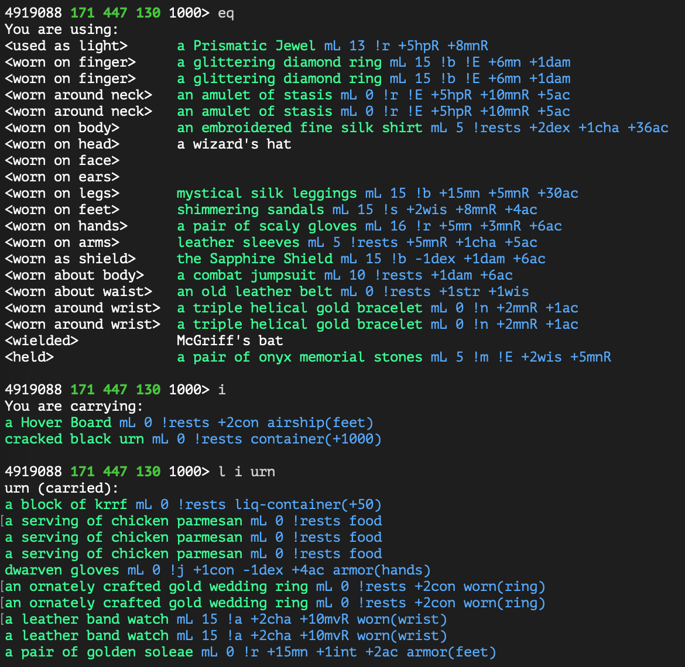

# jtin

Collection of TinTin++ scripts for JediMUD.

Add jtin script to your own startup `.tin` or load adhoc.

`#read j.tin`

**Output**

`jt :: loaded, enter 'jt' for more options`

Check the current state of loaded features.

`jt state`

**Sample Output**

````
[jt] JediMUD TinTin++

* TOON
  + Name: Neytiri
  + Window: #ney

* MAP: enabled

* ITEM-BRIEF: stats

* DATA LOGS
  + Identify: enabled
  + Kill: enabled
  + Loot: enabled

* AUTO TANK
  + Auto-Buff: console
  + Auto-Pummel: disabled
  + Auto-Disarm: disabled
  + Auto-Grapple: disabled
  + Auto-Rescue: disabled
````

## Multi-Boxing

If using multiple `#session` to control 2 toons, then each `#session` must define a unique name and window.

**Primary**
```
#session ney jedimud.com 4000 neytiri.tin
````

`neytiri.tin`

````
jt toon name Neytiri
jt toon window #ney
````

**Secondary**
````
#session tsu jedimud.com 4000 tsutey.tin
````

`tsutey.tin`
````
jt toon name Tsutey
jt toon window #ney
````

> Note the secondary `#session` uses the window of the primary `#session`. This allows messages for the secondary to be output to the primary.


----

# Unicode Maps

Small unicode maps loaded into the right `#split`. 


## Usage

`jt map <state>`

**`state`**
* `enabled`: Allow maps to be loaded
* `disabled`:  

## Legend

| Symbol              | Description   |
| ------------------- | ------------- |
| `[ ]`               |  Basic Path   |
| `[$]`               |  Bank         |
| `[M]`               |  Guild Master |
| `[*]`               |  Recall/Login |
| `[&]`               |  Innkeeper    |
| `[D]`               |  Donation     |
| `[#]`               |  Shop/Vendor  |
| `[%]`               |  Fountain     |
| `[ ]+`              |  Exit up      |
| `[ ]-`              |  Exit down    |
| `↖ ↑ ↗ ← → ↙ ↓ ↘` | One-way path  |

## Aliases

| Alias                          | Description |
| ------------------------------ | ----------- |
| `map show`                     | Show current map on right side of terminal |
| `map hide`                     | Remove map from terminal |
| `map open <map> <room>`        | Open `<map>` and center on `<room>` |
| `map edit`                     | Update map using player's movements |
| `map read`                     | Read-only mode for map |
| `map save`                     | Save changes to map |
| `map create <name>`            | Create a new map with `<name>` |
| `room door <dir>`              | Create door at `<dir>` |
| `room lock <dir>`              | Create locked door at `<dir>` |
| `room loop <dir>`              | Create infinite-loop at `<dir>` |
| `room link <dir> <map> <room>` | Link current room to another `<room>` on a different `<map>` at `<dir>` |
| `room exit`                    | Change current room to one-way path |
| `room shop`                    | Change current room to shop symbol |
| `room inn`                     | Change current room to innkeeper symbol |
| `room master`                  | Change current room to guild master symbol |
| `room fountain`                | Change current room to fountain symbol |
| `room bank`                    | Change current room to bank symbol |
| `room recall`                  | Change current room to recall symbol |
| `room donation`                | Change current room to donation symbol |
| `room aggro`                   | Change current room to aggro color |


# Item Brief

In-line stats on items equipped, in inventory, or within a container.



## Usage

`jt item-brief <state>`

**`state`**
* `stats`: item marked up with basic stats
* `insured`: same markup as `stats` with an additional `(I)` to indicate insured item
* `sac`: only display sac-value for item
* `disabled`: no markup of items

Items are pre-loaded using `data/item-briefs.json`, but this is not an exhaustive list. Use the `ident` alias from [Identify Log] to add items not currently marked-up.


# Data Logs

## Identify Scroll

Capture output from `scroll of identify` to long-running log file. Items are additionally tested for wearable, holdable, wieldable attributes. The log can be parsed to both `json` and `csv`.

### Usage

`jt data-logs identify <state>`

**`state`**
* `enabled`: capture `scroll of identify` output
* `disabled`: or don't

Run alias on item in inventory.

`ident krrf`

Output: `logs/ident.log`

````
-----
Object 'a combat jumpsuit', Item type: ARMOR
Item will give you following abilities:  NOBITS 
Item is: GLOW INVIS LIMITED !DONATE !JUNK UNIQUE INSURED 
Weight: 4, Value: 20000, Rent: 5000, Min. level: 10
AC-apply is 6
Can affect you as :
   Affects: DAMROLL By 1
Item slot: About Body
-----
Object 'a dart', Item type: WEAPON
Item will give you following abilities:  NOBITS 
Item is: !CLER UNIQUE 
Weight: 1, Value: 5, Rent: 0, Min. level: 0
Damage Dice is '1D2' for an average per-round damage of 1.5.
Item slot: Wield
Item slot: Hold
````
> Items are delimited by `-----`

### Update Data

| Description | Script | Output |
| ----------- | ------ | ------ |
| Parse `ident.log` and convert to `json`. Used by other scripts for additional filtering, sorting, and searching. | `py/item_parser.py` | `data/items.json` |
| Convert items into distinct map of short descriptions. Used by `jt item-brief` to markup items inline. | `py/item_brief.py` | `data/item-briefs.json` |
| Convert wearbable items into `csv` for importing into Excel. | `py/item_wearable_csv.py` | `data/item-wearables.csv` |
| Convert items into `csv`, with emphasis on sac value only. Useful for importing into Excel. | `py/item_sac_csv.py` | `data/item-sac.csv` |


## Kill Log

Comma-delimited log of NPC deaths. 

> Note: if multi-boxing, enable loot logging only on one `#session`, otherwise duplicate log entries will occur.

### Usage

`jt data-logs kill <state>`

**`state`**
* `enabled`: log NPC deaths
* `disabled`: or don't

### Log Format

`{npc},{map}`

> Note: if `jt map` is not enabled, then `{map}` will be logged as `unknown`

### Sample Output

`logs/kill.log`

````
The Sailor,midgaard
The Janitor,midgaard
The green enfan,enfan-city
The message bot,midgaard-thief-guild
The Assassin,midgaard-thief-guild
The Knight,midgaard-warrior-guild
The Ninja Lord,midgaard-ninja-guild
Izumo No Okumi,midgaard-ninja-guild
A citizen of Midgaard,midgaard
Welmar's Ranger,midgaard
````

## Loot Log

Comma-delimited log of items looted from corpses.

> Note: can be used by both `#session` while multi-boxing

### Usage

`jt data-logs loot <state>`

**`state`**
* `enabled`: log corpse loot
* `disabled`: or don't

### Log Format

`{npc},{item},{map}`
> Note: If corpse is empty, then `{item}` is logged empty

> Note: if `jt map` is not enabled, then `{map}` will be logged as `unknown`

### Sample Output

`logs/loot.log`

````
an enormous mound of gold coins,Shudde-M'ell,northern-plains
woolen sleeves,Shudde-M'ell,northern-plains
a clear potion,Shudde-M'ell,northern-plains
a strange template,Shudde-M'ell,northern-plains
,the pile of slime,wandering-ship
a big pile of gold coins,the snarling greza officer,wandering-ship
,the snarling greza officer,wandering-ship
````


# Auto Tank

## Auto Buff

Notify off buff/debuff changes and prevent combat when tank buffs are missing.

### Usage

`jt auto-tank auto-buff <state>`

**`state`**
* `console`: send warning messages to target window, as configured by `jt toon window`
* `group`: send warning messages to `groupsay`
* `disabled`: don't send warning messages

> Note: `group` is slower than `console` due to combat and spell lag. 

### Configure

`jt auto-tank auto-buff set <buff> <state>`

**`buff`**
* `sanctuary`
* `stone-skin`
* `aid`
* `bless`
* `armor`

**`state`**
* `block`: prevent player from attacking
* `warn`: allow player to attack, but send alert message
* `disabled`: do nothing

## Auto Pummel

Perform pummel when:
  1) Another player assists you, or
  2) Previous pummel fails, or
  3) Previous pummel is successful

### Usage

`jt auto-tank auto-pummel <state>`

**`state`**
* `enabled`: perform auto-pummel
* `disbaled`: or don't

## Auto Disarm

> Coming soon!

## Auto Grapple

> Coming soon!

## Auto Rescue

> Coming soon!