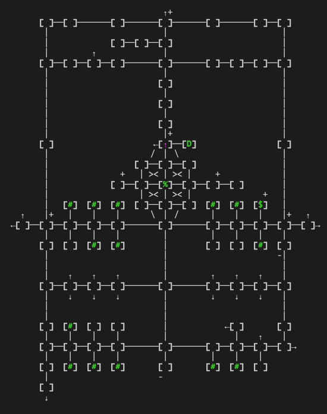

# tintin-maps

Unicode maps for Jedimud generated with TinTin++.



## Legend

`[ ]` Basic Path

`[$]` Bank

`[#]` Shop/Vendor

`[%]` Fountain

`[D]` Donation

`[M]` Guild Master

`[&]` Innkeeper

`↖ ↑ ↗ ← · → ↙ ↓ ↘` Map Exit

`[ ]+` Exit Up

`[ ]-` Exit Down

## Usage

**show map**

````
#alias map_show {
    #split 0 1 0 -80;
    #map offset 1 81 -1 -1;
}
````

**hide map**

````
#alias map_hide {
    #split;
    #map offset;
}
````

**edit map**

````
#alias map_edit {
    #showme edit-mode enabled for $map_current;
    #map sync $map_current;
    #map flag static off;
}
````

**save map**
````
#alias map_save {
    #showme saving $map_current;
    #map write $map_current;
}
````

**read-only map**
````
#alias map_read {
    #showme read-only enabled for $map_current;
    #map flag static on;
}
````

**create new map**
````
#alias map_create {
    #map create;
    #map goto 1;
    #map flag VTmap on;
    #map flag UnicodeGraphics on;
    #map flag direction on;
    map_hide;
    map_show;
    #map legend {unicode graphics} { { } {\u2198} {\u2197} {>} {\u2199} {\u2E0C\u2E0D} {\uFF0F} {>\u2E0D} {\u2196} {\uFF3C} {\u2E1D\u2E1C} {>\u2E1C} {<} {\u2E0C<} {\u2E1D<} {><} {-} {\u2191} {\u2193} {\u2502} {+} {\u2192} {\u2190} {\u2500} {[} {(} {]} {)} }
}
````
> Unicode graphics for TinTin++ are currently broken for 1-way paths. Changing the legend fixes this issue, but it must be set in each map file.

**Recite group recall to Midgaard**

````
#alias rc {
    c 'group recall';
    open_midgaard;
}

#alias open_midgaard {
    #map read midgaard.map;
    #map goto 1; 
    #map flag static on;
    map_hide;
    map_show;
    #variable map_current midgaard.map;
}
````
> `open_midgaard` can be called on TinTin++ startup by adding it to a session file: `#session j jedimud.com 4000 jedimud.tin`