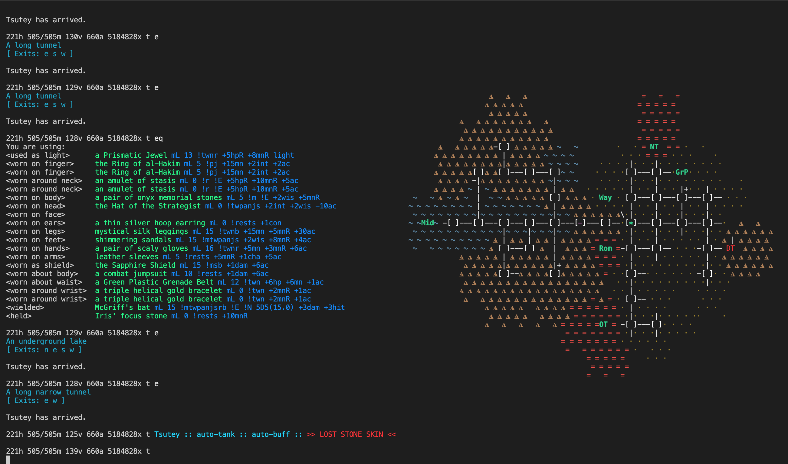

# jtin

A collection of TinTin++ scripts for JediMUD.

<br/>




<br/>

# Getting Started 

Create login csv with credentials, session, and custom file for each toon.

```sh
touch ./data/login.csv
echo 'neytiri,password,ney,toons/neytiri.tin' >> ./data/login.csv
echo 'tsutey,password,tsu,toons/tsutey.tin' >> ./data/login.csv
echo 'neysac,password,ney,toons/sac.tin' >> ./data/login.csv
cat ./data/login.csv
```
> Format is: `{toon name},{password},{session name},{file to load after login}`

> If multi-boxing, be sure each toon has a unique session name

Create a toon-specific tin with jtin customizations.
```sh
touch ./toons/neytiri.tin
echo 'jt map enabled;' >> ./toons/neytiri.tin
echo 'map open midgaard 1;' >> ./toons/neytiri.tin
echo 'jt item-brief stats;' >> ./toons/neytiri.tin
cat ./toons/neytiri.tin
```

Start tintin++ with jtin

```sh
tt++ j.tin
```

Login with toon from `login.csv`
```txt
log neytiri
```

After login, view available options
```
jt state
```
```
[jt] JediMUD TinTin++

* TOON
  + Name: Neytiri
  + Window: #ney

* MAP: enabled

* ITEM-BRIEF: stats

* DATA LOGS
  + Identify: enabled
  + Kill: disabled
  + Loot: enabled

* AUTO TANK
  + Auto-Buff: disabled
  + Auto-Pummel: disabled
  + Auto-Disarm: disabled
  + Auto-Grapple: disabled
  + Auto-Rescue: disabled
```

<br/> 

# Additional Features

- [Unicode Maps](https://github.com/jedimud/jtin/wiki/Unicode-Maps)
- Data Logs
  - [Identify Scroll](https://github.com/jedimud/jtin/wiki/Identify-Scroll)
  - [Item Brief](https://github.com/jedimud/jtin/wiki/Item-Brief)
  - [Loot Log](https://github.com/jedimud/jtin/wiki/Loot-Log)
  - [Kill Log](https://github.com/jedimud/jtin/wiki/Kill-Log)
- Auto-Tank
  - [Auto Buff](https://github.com/jedimud/jtin/wiki/Auto-Buff)
  - [Auto Pummel](https://github.com/jedimud/jtin/wiki/Auto-Pummel)
  - [Auto Disarm](https://github.com/jedimud/jtin/wiki/Auto-Disarm)
  - Auto-Grapple
  - Auto-Rescue


