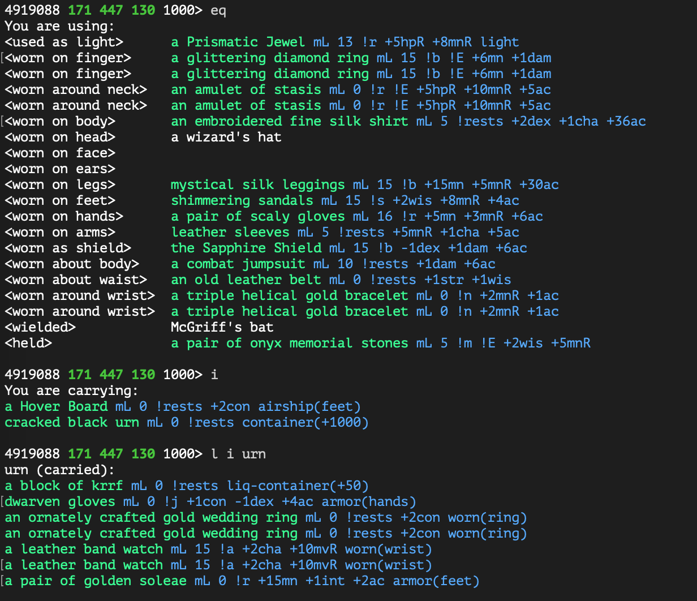

[README.md](../../../) > item-brief.md

----

# Item Brief

In-line stats on items equipped, in inventory, or within a container.

## Usage

Load item-brief tin as class at TinTin++ startup.

`#class item-brief read tins/item-brief.tin`

Items are pre-loaded using `data/item-briefs.json`, but this is not an exhaustive list. Use the `ident` alias from [Identify Scroll Log](identif-scroll-log.md) to add items not currently marked-up.

## Configuration

**Toggle (insured) flag**

The `(insured)` flag can be toggled on/off with alias `item_brief toggle insured`. When on, `(insured)` is replaced with `(I)`.

