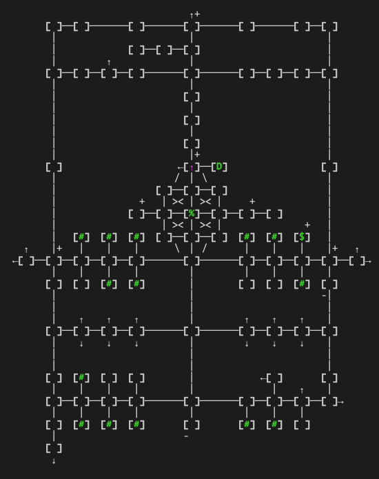

[README.md](../../../) > mapper.md

----

# Unicode Mapper

Small unicode maps loaded into the right `#split` of TinTin++. 

## Usage

Load mapper tin as class at TinTin++ startup.

`#class mapper read tins/mapper.tin`

## Legend

| Symbol              | Description   |
| ------------------- | ------------- |
| `[ ]`        |  Basic Path   |
| `[ ]` |  Aggro Room |
| `[$]`               |  Bank         |
| `[M]`               |  Guild Master |
| `[*]`               |  Recall/Login |
| `[&]`               |  Innkeeper    |
| `[D]`               |  Donation     |
| `[#]`               |  Shop/Vendor  |
| `[%]`               |  Fountain     |
| `[ ]+`              |  Exit up      |
| `[ ]-`              |  Exit down    |
| `↖ ↑ ↗ ← · → ↙ ↓ ↘` | One-way path  |

## Aliases

| Alias                | Description |
| -------------------- | ----------- |
| `map_show`           | Show current map on right side of terminal |
| `map_hide`           | Remove map from terminal |
| `map_create`         | Initialize a new map, useful for mapping a new zone |
| `map_edit`           | Automatically track movements and update map |
| `map_read`           | Read-only mode for map |
| `map_save`           | Save current map to disc |
| `map_open %1`        | Open map and center on map entrance, where %1=name of map |
| `room_link %1 %2 %3` | Link rooms between maps, where %1=direction, %2=map to link to, %3=room to link to |
| `room_exit`          | Change room to one-way path |
| `room_shop`          | Change room to shop symbol |
| `room_inn`           | Change room to innkeeper symbol |
| `room_master`        | Change room to guild master symbol |
| `room_fountain`      | Change room to fountain symbol |
| `room_bank`          | Change room to bank symbol |
| `room_recall`        | Change room to recall symbol |
| `room_donation`      | Change room to donation symbol |
| `room_aggro`         | Change room to aggro |

